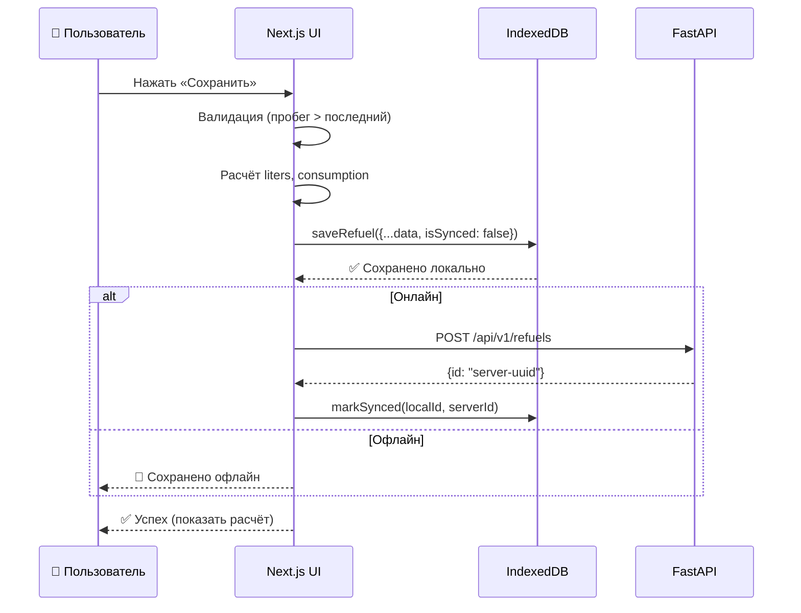
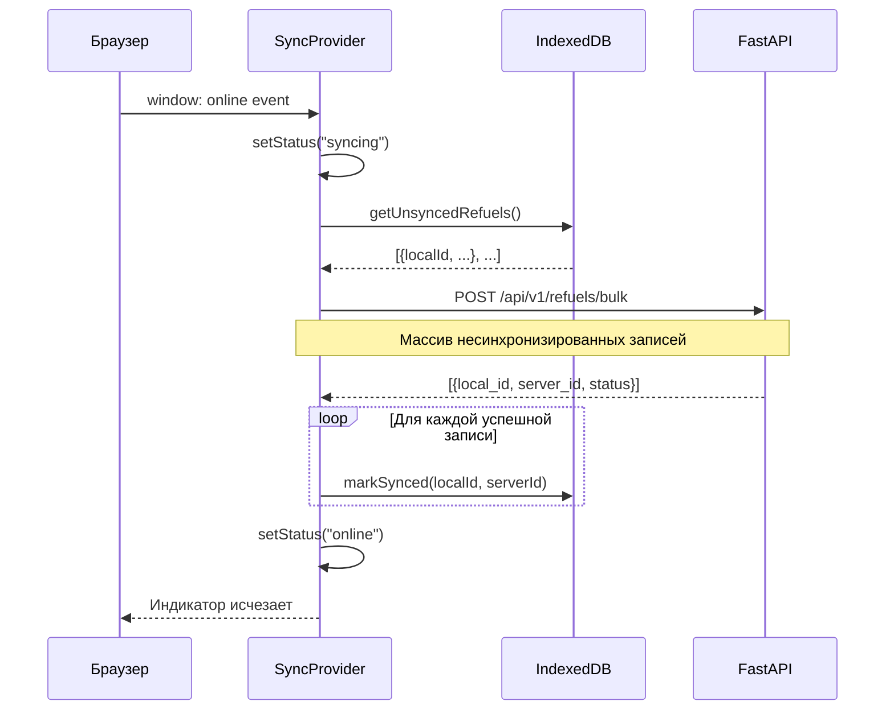

# Офлайн-режим и синхронизация

## Алгоритм сохранения заправки



## Алгоритм синхронизации при восстановлении сети



## Дедупликация

Каждая локальная запись имеет `localId` (генерируется на клиенте).  
При синхронизации сервер проверяет уникальность по `local_id`:

```python
# backend/src/routers/refuels.py
exists = await db.execute(
    select(Refuel.id).where(Refuel.local_id == item.local_id)
)
if exists.scalar_one_or_none():
    results.append({"local_id": item.local_id, "status": "skipped"})
    continue
```

Это гарантирует что повторная синхронизация не создаёт дублей.

## IndexedDB схема (Dexie.js)

```typescript
// frontend/lib/db.ts
interface LocalRefuel {
  localId: string;       // PK — UUID клиента
  serverId?: string;     // ID на сервере (после sync)
  isSynced: boolean;     // false = ожидает отправки

  odometer: number;
  fuelPrice: number;
  totalCost: number;
  liters: number;        // Вычислено локально
  distance?: number;     // Вычислено локально
  consumption?: number;  // Вычислено локально
  createdAt: string;     // ISO string
}
```

!!! warning "Ограничение Safari"
    IndexedDB в приватном режиме Safari работает с ограниченным объёмом.
    Предупредить пользователя об этом при первом открытии.
