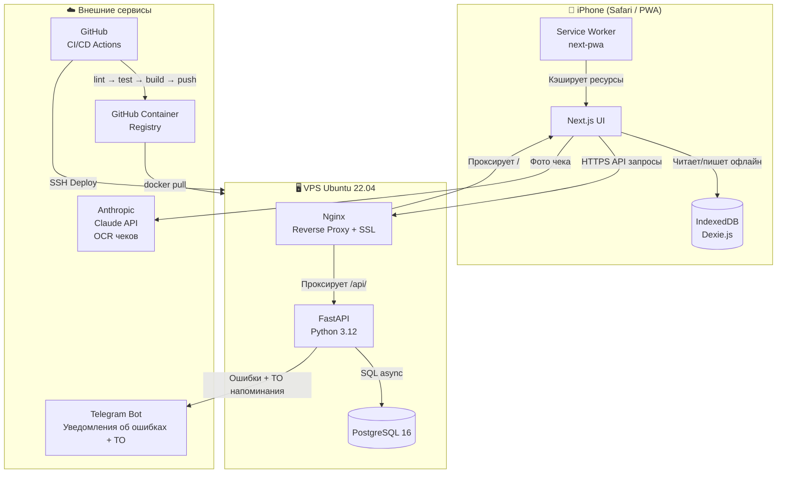

# Архитектурный обзор

## Компонентная диаграмма



---

## Слои приложения

```
HTTP Request
    ↓
FastAPI Router  (src/routers/)       — валидация входных данных (Pydantic)
    ↓
Service Layer   (src/services/)      — бизнес-логика, расчёты, уведомления
    ↓
SQLAlchemy ORM  (src/database/)      — персистентность
    ↓
PostgreSQL 16
```

### Ключевые принципы

**Service-слой** — `refuel_service.py` содержит всю бизнес-логику создания заправки. Роутеры только валидируют HTTP и вызывают сервис. Это позволяет тестировать логику без HTTP-слоя и переиспользовать между `POST /refuels` и `POST /refuels/bulk`.

**Офлайн-first** — каждое действие записывается в IndexedDB до отправки на сервер. Сервер — резервное хранилище, не источник истины для UI.

**Единые расчёты** — `calculations.py` (backend) и `calculations.ts` (frontend) содержат идентичные формулы. `calculations.test.ts` гарантирует это автоматически.

---

## Структура директорий

```
fuel-tracker/
├── backend/
│   ├── src/
│   │   ├── database/
│   │   │   ├── connection.py    # Engine, get_db, check_db_connection
│   │   │   ├── models.py        # Refuel ORM model
│   │   │   └── migrations/      # Alembic (versions/0001, 0002)
│   │   ├── routers/             # HTTP-слой (тонкий)
│   │   └── services/
│   │       ├── refuel_service.py    # Бизнес-логика создания заправки
│   │       ├── calculations.py      # Формулы расчёта
│   │       ├── notifications.py     # Telegram-алерты
│   │       └── ocr_service.py       # Claude API
│   └── alembic.ini
├── frontend/
│   ├── app/
│   │   ├── page.tsx             # Dashboard
│   │   ├── add/page.tsx         # Форма заправки + OCR
│   │   ├── history/page.tsx     # История + фильтры
│   │   ├── stats/page.tsx       # Графики + таблица по месяцам
│   │   ├── error.tsx            # Error Boundary
│   │   ├── global-error.tsx     # Root Error Boundary
│   │   ├── not-found.tsx        # 404
│   │   └── loading.tsx          # Route transition indicator
│   ├── components/
│   │   ├── SyncProvider.tsx     # Offline/online status
│   │   ├── Skeleton.tsx         # Loading placeholders
│   │   └── HistoryFilters.tsx   # Фильтр по типу топлива / периоду
│   └── lib/
│       ├── db.ts                # Dexie IndexedDB
│       ├── api.ts               # HTTP client
│       ├── sync.ts              # Offline-first logic
│       ├── calculations.ts      # Формулы (зеркало Python)
│       └── calculations.test.ts # Vitest тесты
├── tests/
│   ├── conftest.py              # Fixtures: AsyncClient + SQLite in-memory
│   ├── test_calculations.py     # 24 unit tests
│   └── test_api_refuels.py      # 17 integration tests
├── docs/                        # MkDocs Material site
├── scripts/
│   ├── ios_widget.js            # Scriptable виджет для iPhone
│   ├── import_numbers.py        # Импорт из Numbers CSV
│   ├── backup.sh                # PostgreSQL backup
│   ├── init_ssl.sh              # Let's Encrypt
│   ├── health_check.sh
│   └── build_docs.sh
└── .github/
    ├── workflows/
    │   ├── deploy.yml           # lint → test → build → deploy
    │   └── docs.yml             # mkdocs → GitHub Pages
    └── dependabot.yml           # Авто-обновление зависимостей
```
