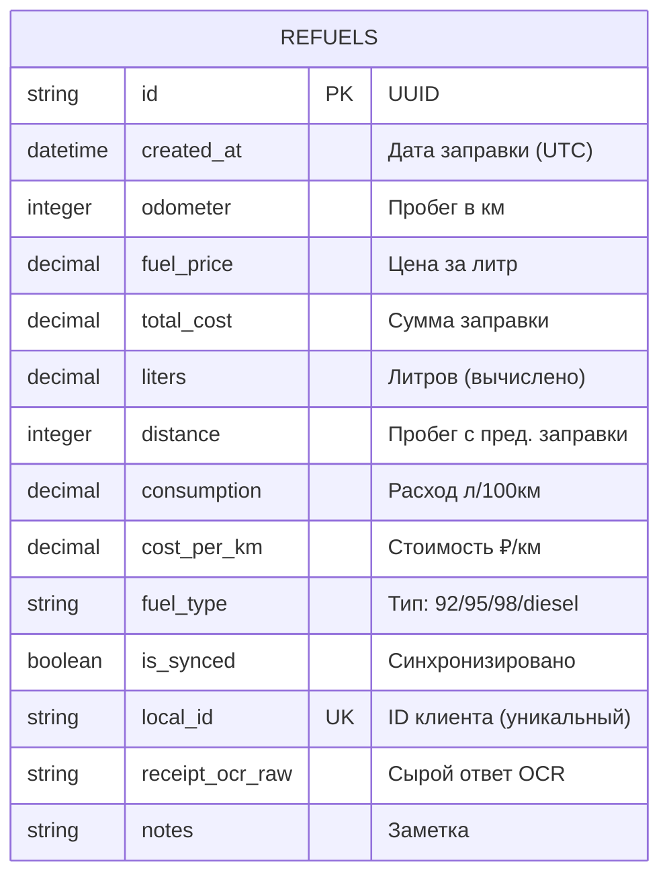

# Модели базы данных

## Схема таблицы `refuels`



## Миграции (Alembic)

| Версия | Описание |
|--------|----------|
| `0001_initial` | Создание таблицы `refuels` с базовыми полями |
| `0002_fuel_type_cost_per_km` | Добавление `fuel_type` и `cost_per_km` |

```bash
# Применить все миграции
cd backend && alembic upgrade head

# Откатить последнюю
alembic downgrade -1

# Статус
alembic current
alembic history
```

## Автогенерация референса

::: src.database.models
    options:
      show_root_heading: true
      show_source: true
