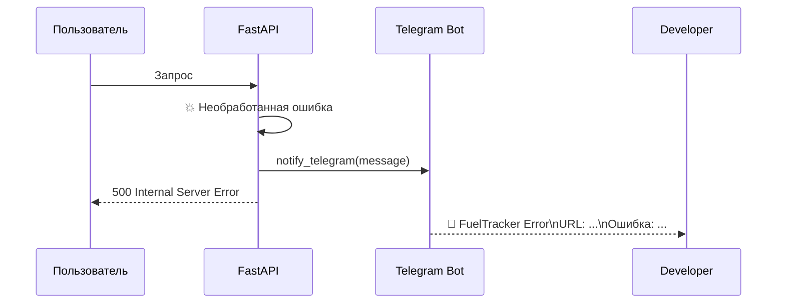

# Telegram-уведомления об ошибках

Каждая необработанная ошибка в production автоматически отправляется в Telegram.

## Как работает



## Автогенерация референса

::: src.services.notifications
    options:
      show_root_heading: true
      show_source: true

## Настройка

В `.env`:
```bash
TELEGRAM_BOT_TOKEN=   # Получить у @BotFather
ADMIN_TELEGRAM_ID=    # Получить у @userinfobot
```

!!! note "Отдельный бот"
    Рекомендуется создать отдельного бота только для алертов через @BotFather,
    не использовать токен основного бота (если он есть).
