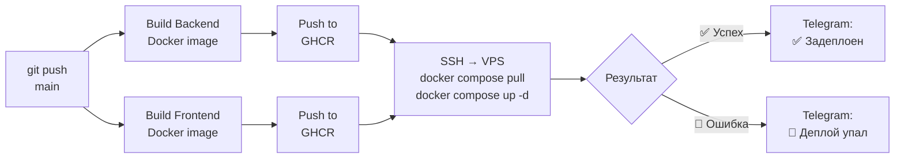

# GitHub Actions CI/CD

## Пайплайн



## GitHub Secrets

Настроить в репозитории: **Settings → Secrets and variables → Actions**

| Secret | Значение |
|--------|----------|
| `SSH_PRIVATE_KEY` | Содержимое файла `~/.ssh/github-actions-key` |
| `VPS_HOST` | IP-адрес сервера |
| `NEXT_PUBLIC_API_URL` | `https://your-domain.com/api/v1` |
| `NEXT_PUBLIC_API_KEY` | Значение `API_KEY` из `.env` |
| `TELEGRAM_BOT_TOKEN` | Токен бота для уведомлений |
| `ADMIN_TELEGRAM_ID` | Твой Telegram ID |

## Генерация SSH-ключа для деплоя

```bash
# На Mac — создать специальный ключ для CI/CD
ssh-keygen -t ed25519 -f ~/.ssh/github-actions-key -N "" -C "github-actions-fuel-tracker"

# Добавить публичный ключ на VPS
ssh-copy-id -i ~/.ssh/github-actions-key.pub deploy@YOUR_VPS_IP

# Скопировать приватный ключ → вставить в GitHub Secret SSH_PRIVATE_KEY
cat ~/.ssh/github-actions-key
```

## Ручной деплой (без CI/CD)

```bash
ssh deploy@YOUR_VPS_IP \
  "cd /home/deploy/fuel-tracker && docker compose pull && docker compose up -d"
```
