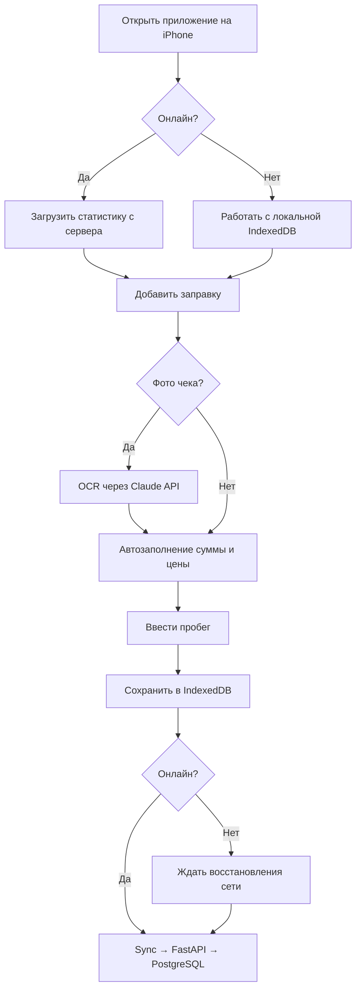

# ⛽ FuelTracker

**PWA-приложение для трекинга расходов на топливо.**  
Устанавливается на iPhone как иконка, работает офлайн, синхронизируется с сервером, распознаёт чеки АЗС по фото.

---

## Быстрая навигация

-   :material-rocket-launch: **Быстрый старт**

    ---

    Локальный запуск за 5 минут

    [:octicons-arrow-right-24: К инструкции](deployment/quickstart.md)

-   :material-api: **API Reference**

    ---

    Все эндпоинты с примерами запросов

    [:octicons-arrow-right-24: К документации API](api/overview.md)

-   :material-cellphone: **Архитектура**

    ---

    PWA, офлайн-sync, OCR

    [:octicons-arrow-right-24: К архитектуре](architecture/overview.md)

-   :material-server: **Деплой**

    ---

    VPS, SSL, GitHub Actions

    [:octicons-arrow-right-24: К деплою](deployment/vps-ssl.md)

---

## Технологический стек

=== "Frontend"

    | Технология | Версия | Назначение |
    |------------|--------|------------|
    | Next.js | 14 (App Router) | PWA фреймворк |
    | TypeScript | 5 | Типизация |
    | Tailwind CSS | 3 | Стили |
    | Dexie.js | 3 | IndexedDB (офлайн) |
    | next-pwa | 5 | Service Worker |
    | Recharts | 2 | Графики |

=== "Backend"

    | Технология | Версия | Назначение |
    |------------|--------|------------|
    | FastAPI | 0.111 | REST API |
    | Python | 3.12 | Язык |
    | SQLAlchemy | 2 (async) | ORM |
    | PostgreSQL | 16 | База данных |
    | Alembic | 1.13 | Миграции |
    | Anthropic SDK | 0.28 | OCR чеков |

=== "Инфраструктура"

    | Технология | Назначение |
    |------------|------------|
    | Docker Compose | Контейнеризация |
    | Nginx + Certbot | Reverse proxy + HTTPS |
    | GitHub Actions | CI/CD |
    | VPS Ubuntu 22.04 | Хостинг |

---

## Ключевые флоу

---

## Автомобиль

- **Модель:** Toyota Fielder
- **Начальный пробег:** 78 700 км (импортирован из Apple Numbers)
